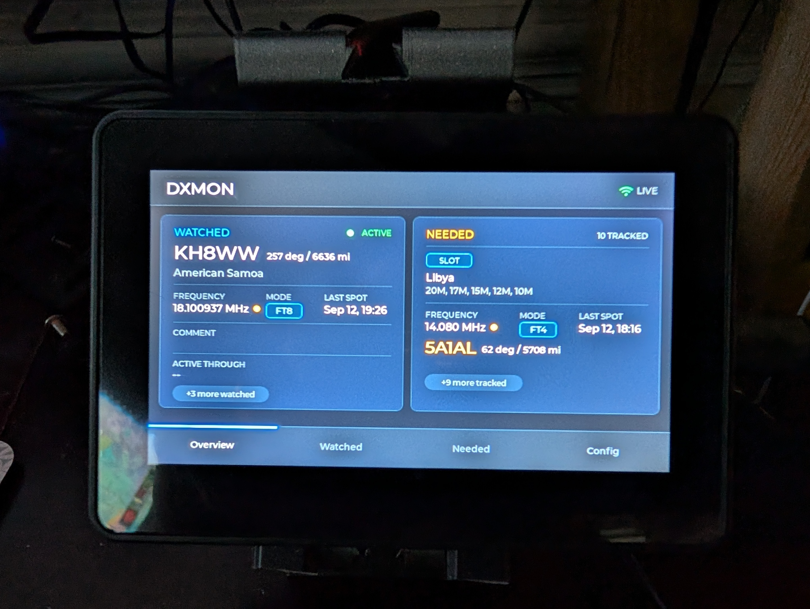

# DXMon -- DX Monitor

**"Is a DX station I care about active right now, and where should I listen?"**



DXMon is a small, glanceable desk instrument for the ham shack. It watches for
specific DXpeditions and DXCC entities you still need, and gives you an
at-a-glance answer -- on a dedicated touchscreen device, and through a web
interface you can check from any browser on your network.

It's the third instrument in the **N4MI Desktop Instrument Series**, a family
of small desk instruments each answering one operational question at a
glance:

- **[PropMon](https://github.com/N4MI73/n4mi-propagation-monitor)** -- "Can I make the contact?" (HF band conditions, solar indices)
- **[APRSMon](https://github.com/N4MI73/n4mi-aprs-monitor)** -- "What's happening around me?" (local weather + APRS activity)
- **DXMon** (this repo) -- "Is a DX station I care about active right now, and where should I listen?"

## What it does, briefly

- Tracks a curated list of **Watched** DXpedition callsigns and **Needed**
  DXCC entities/band-mode slots, and alerts in real time when HamAlert spots
  a match.
- Shows the spotted callsign, band/mode/frequency, and a beam heading and
  distance to it, right on the device screen.
- Lets you drill into recent activity and spot history without leaving the
  device.
- All curation (deciding what to track, building HamAlert triggers) happens
  through a web page on your local network -- the device itself is a thin
  display, not where you manage configuration.

For the full feature list and how to actually use it day to day, see
**[User_Guide.md](User_Guide.md)**.

## Hardware

DXMon runs on a **Waveshare ESP32-S3-Touch-LCD-4.3B** -- a 4.3-inch, 800x480,
touch-capable landscape display. Unlike the round-display instruments
elsewhere in this series, DXMon's content is list-heavy, so it uses a
touchscreen instead of a rotary encoder as its input model.

The backend runs as two small services on a NAS or any always-on machine that
can run Docker -- it doesn't need to run on the same computer as anything
else in the shack.

## Data sources

- **[NG3K's Announced DX Operations (ADXO)](https://www.ng3k.com/Misc/adxoplain.html)**,
  used with permission from Bill Feidt/NG3K -- the discovery source for
  browsing and selecting what to watch, and for "starts in N days" data on
  upcoming DXpeditions.

  > **ADXO permission:** DXMon can retrieve announced-operation information
  > from NG3K's ADXO text page. Permission granted to N4MI applies to the
  > project author's personal installation and should not be assumed to
  > cover other installations. Before enabling ADXO retrieval, contact the
  > ADXO owner and request permission for your instance. DXMon limits
  > retrieval to once daily and caches the last successful result to
  > minimize load.

- **[HamAlert](https://hamalert.org/)** -- real-time spot matching. This is
  the actual alerting path; DXMon's core function doesn't depend on ADXO's
  continued availability.
- **[pyhamtools](https://github.com/dh1tw/pyhamtools)** (via
  country-files.com data) -- beam heading and distance calculations.

## Repository structure

```
n4mi-dx-monitor/
├── server/          -- backend (Flask + a Telnet listener). See server/README.md
│                       for setup instructions (Portainer/Docker).
├── firmware/         -- ESP32-S3 / LVGL / PlatformIO firmware. See
│                       firmware/README.md for build and flashing instructions.
├── User_Guide.md     -- what DXMon does and how to use it, feature by feature.
└── README.md         -- this file
```

## Getting started

1. Set up the backend first -- see **[server/README.md](server/README.md)**.
2. Build and flash the firmware -- see **[firmware/README.md](firmware/README.md)**.
3. Once both are running, see **[User_Guide.md](User_Guide.md)** to start
   curating your Watched and Needed lists.

## Credit

DXpedition schedule data courtesy of Bill Feidt/NG3K's
[Announced DX Operations](https://www.ng3k.com/Misc/adxoplain.html), used with
his permission. A great long-running resource for the ham radio community --
go check it out directly if you're not already using it.

## License

Not yet decided. This project will be freely available and open for anyone to
build their own instrument, matching the rest of the N4MI Desktop Instrument
Series.
