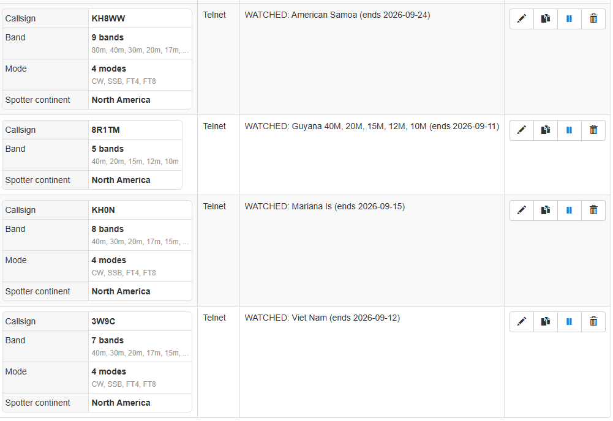
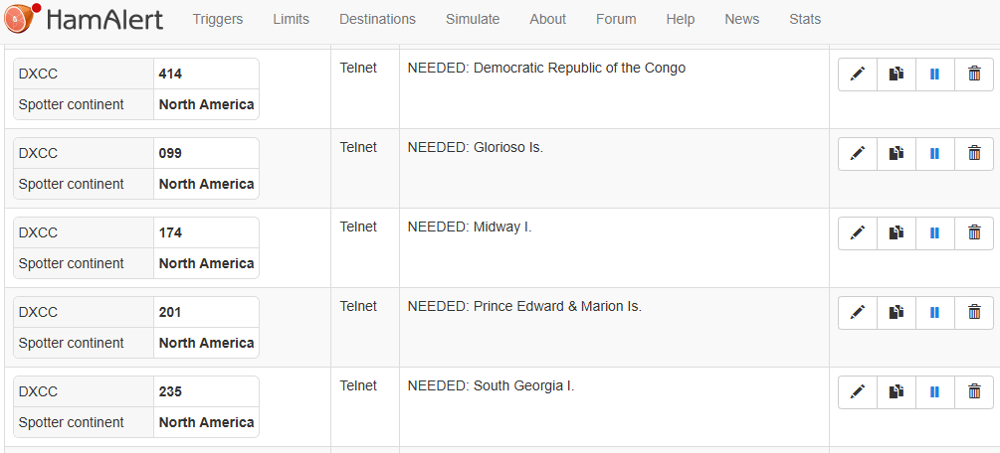
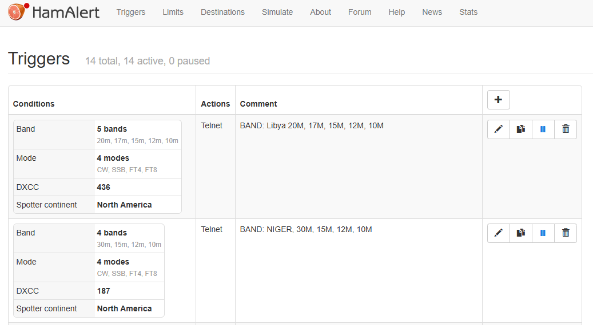

# DXMon User Guide

This guide covers what DXMon does and how to use it, once both the
[server](server/README.md) and [firmware](firmware/README.md) are set up and
running. It doesn't cover installation -- see those two READMEs for that.

## The big picture

DXMon tracks two kinds of things:

- **Watched** -- specific DXpedition callsigns you're following (e.g. a
  callsign currently operating from a rare entity).
- **Needed** -- DXCC entities or specific band/mode gaps you still need,
  curated by you as a short list matching exactly what you've set up real
  HamAlert alerts for. Any Needed entry can be **pinned** to keep it near
  the top of the list even when nothing's currently active for it.

Everything you curate on the web pages shows up on the physical device,
updated automatically as real spots come in from HamAlert.

## The device screens

The device has four tabs across the bottom: **Overview**, **Watched**,
**Needed**, and **Config**.

### Overview

Two panels side by side. The left panel shows your Watched list; the right
shows your Needed list. Each panel shows:

- The featured entry -- whichever one has the most recent real activity.
- Frequency, mode, and when it was last spotted.
- A small colored dot next to the frequency showing the **current band
  condition** for that spot (green/amber/red for good/fair/poor), sourced
  from PropMon. No dot at all means the condition isn't available right
  now -- not a fourth "unknown" state, just no data.
- The spotted callsign and a beam heading + distance to it (e.g. "5A1AL --
  62 deg / 9186 km"), so you know which direction to point your antenna.
- A count of how many other entries you're tracking.

If nothing's currently active, the panel falls back to showing the last real
hit you had, or -- if nothing's ever hit yet -- a simple tracked-count line.

**A genuinely new spot briefly blinks** -- the callsign text and the whole
panel's border flash for a few seconds -- so a real hit catches your
attention even from a glance across the room. The same spot showing up
again on the next routine update doesn't re-trigger it; only an actual new
hit does.

**Tap either panel** to open a full-screen **Recent Activity** feed for that
category -- a scrolling list of every real spot across everything in that
category, most recent first. **Tap any individual spot within that feed**
to drill in further to that callsign's own recent spot history (see
"Drilling into detail" below).

### Watched (tab)

The full list of everything you're watching, each showing its own status
(active/upcoming/waiting for a spot), last spot detail, and beam heading.
Scroll to see everything. **Tap any entry** to see that callsign's own
recent spot history.

### Needed (tab)

The full list of everything in your curated Needed list. Each entry shows an
**ENTITY** or **SLOT** badge:

- **ENTITY** -- a whole never-confirmed DXCC entity, any band or mode.
- **SLOT** -- a specific band/mode gap on an entity you've already confirmed.

A small **PINNED** badge appears on any entry you've pinned from the web
curation page -- see "Pinning priority entries" below.

Since a single Needed entry can be worked by different callsigns over time
(e.g. different DXpeditions activating the same rare entity), the roster
shows whichever callsign was actually heard for each real hit. **Tap any
entry** to see that entity's own recent spot history across every callsign
that's worked it.

### Drilling into detail

Two related but distinct drill-down screens, reached a few different ways:

- **Recent Activity** (from tapping an Overview panel) -- a chronological
  feed of every real spot across a whole category (everything Watched, or
  everything Needed), newest first.
- **Spot History** (from tapping an individual spot within Recent Activity,
  or tapping a roster row on the Watched or Needed tab) -- the last 10 real
  spots for one specific target. For a Watched entry or an individual
  callsign, this is straightforward -- one callsign's own history. For a
  Needed entity, it's the entity's whole history, potentially spanning
  several different callsigns over time, each shown with its own beam
  heading since they can be worked from different locations.

Both are full-screen views with a back arrow in the top-left corner to
return to wherever you came from.

### Config

Shows Wi-Fi connection status and IP address, whether the ADXO and HamAlert
backend connections are healthy, how many entries you're watching, the URL
for the web curation pages, and the firmware version. Includes a **Force
Refresh** button if you want to pull fresh data immediately rather than
waiting for the next automatic update.

**Wi-Fi Setup** lets you connect DXMon to a different network without
reflashing the firmware:

1. Tap **Wi-Fi Setup**. The device scans nearby networks, then opens its own
   temporary network (`DXMon-Setup` by default).
2. Connect your phone to that network. Most phones pop open a sign-in page
   automatically; if not, browse to `192.168.4.1`.
3. Pick your real network and enter its password. **Connect to the same
   network your DXMon server is running on** -- otherwise the device won't
   be able to reach it once connected.
4. On success, the device saves the new credentials and restarts on the new
   network. Tapping **Cancel** at any point also restarts the device, back
   on whichever network it was using before.

The device's touchscreen is unresponsive for a few seconds while it actually
tries connecting with what you entered -- that's expected, since your
attention is on the phone at that moment anyway.

## Curating your lists (web pages)

All curation happens on the web pages served by the backend --
`http://<your-server-ip>:8083/`. The device itself never edits your lists;
it only displays what you've curated here.

### Browse ADXO (`/`)

Browse currently-announced DXpeditions and add any you want to follow to
your Watched list with one click.

### Watched (`/watched`)

Your curated Watched list. Remove an entry, or use the **Create HamAlert
trigger** link next to it to get a ready-to-paste trigger recipe for that
callsign.

### Needed (`/needed`)

Your curated Needed list. To add an entry:

1. Type the entity name -- **copy it exactly from HamAlert's own DXCC
   condition picker** when you build the matching trigger. Matching only
   handles case and spacing differences, not spelling differences, so this
   is the one step worth getting right.
2. Check any bands and/or modes for a specific slot, or leave everything
   unchecked for a whole-entity target.
3. Optionally add a note, then submit.

Existing entries can be **edited in place** (no need to delete and re-add),
and any entry sitting in the list 30+ days gets a small flag as a reminder to
review whether it's still worth tracking.

**Pinning priority entries:** click the star (☆) next to any entry to pin
it. A pinned entry with nothing currently live floats above the rest of the
alphabetical list -- but a pin never outranks an actual live hit elsewhere,
so the entry with real activity right now always wins regardless of pin
status. Once pinned, use the up/down arrows next to it to reorder it within
your pinned entries. Unpin with the filled star (★).

### Trigger Builder (`/triggers`)

Generates a ready-to-paste HamAlert trigger recipe for any callsign or DXCC
entity. HamAlert has no API for creating triggers automatically -- you still
paste the result into hamalert.org yourself -- but this tool does the
recipe-splitting math for you (avoiding HamAlert's own spot-volume limits on
large multi-entity triggers).

If you're building a trigger for an entity, check **"also add to Needed"**
to curate it as a whole-entity target at the same time, without a separate
trip to the Needed page.

### HamAlert (`/hamalert`)

Shows recent real spots HamAlert's own triggers have matched, plus a beam
headings side panel for every distinct callsign currently in that list.
Useful for eyeballing what's actually coming through before it shows up on
the device.

### Preview (`/preview`)

An in-browser rendering of the device's own screens, useful as a quick
remote check when the physical device isn't nearby. It's meant as a
good-enough glance, not an exact mirror of every device screen -- the
band-condition dot and drill-down screens are included; pin/favorite
badges and the new-spot flash currently are not. Small **?** icons around
the screens give short explanations on hover (or tap, on a phone/tablet).

## Beam heading

Wherever you see a callsign next to a heading and distance (device screens,
the HamAlert page, the Watched/Needed web pages), that's a great-circle
bearing and distance from your own station to that callsign, computed
automatically. If a heading is ever missing, the underlying lookup couldn't
resolve that particular callsign -- nothing to configure, it just means that
one entry didn't have a usable heading calculated for it.

## Best Practices

### Building good HamAlert triggers

- **Use the Trigger Builder (`/triggers`)** rather than hand-building
  conditions directly in HamAlert. It handles the math for splitting a
  large multi-entity trigger into smaller ones for you, which matters
  because HamAlert itself caps how many spots a single trigger can generate
  per day -- a trigger covering too many entities at once can silently hit
  that ceiling.
- **Copy the entity name directly from HamAlert's own DXCC condition
  picker**, and paste that exact string into DXMon's Needed curation page.
  Matching between the two only tolerates case and spacing differences, not
  spelling differences -- this is the single most common reason a real,
  correctly-firing HamAlert trigger never shows up as a hit on DXMon.
- **When curating a SLOT** (a specific band/mode gap), check the same
  bands and modes in DXMon that you set as conditions in the real HamAlert
  trigger. DXMon's checkboxes deliberately mirror HamAlert's own
  trigger-condition options for exactly this reason -- if a mode isn't one
  of the four checkboxes offered, HamAlert can't actually trigger on it for
  this kind of entry either.
- **Curating an entry doesn't create a HamAlert trigger by itself.** A
  Needed or Watched entry with no real HamAlert trigger behind it will
  never show activity, even if genuine spots for it exist elsewhere.
  Curation and trigger-building are two separate, deliberate steps.
- **Use "also add to Needed"** on the Trigger Builder page when building an
  entity-level trigger, to curate and set up the alert in one pass instead
  of two separate trips.

#### Examples from a real setup

The three trigger shapes in practice, all with a **Spotter Continent**
filter (North America) added -- this keeps busy callsigns and entities well
under HamAlert's own daily spot-volume limit, per the same real fix
already applied elsewhere in this project's own trigger history.

**Watched callsign trigger** -- callsign, band, and mode conditions, one
per DXpedition you're following:

**Needed whole-entity trigger** -- DXCC condition only, no band/mode
restriction, since these are ENTITY-kind Needed targets (any band, any
mode counts):

**Needed band-slot trigger** -- DXCC, band, and mode conditions together,
matching exactly the bands/modes checked on DXMon's own Needed curation
page for that SLOT-kind entry:

### Keeping your Needed list useful

- **Pin sparingly.** Pinning is for entities you genuinely want to see
  ahead of the pack even when nothing's active -- if everything ends up
  pinned, it stops meaning anything. The list is meant to stay short by
  design; pins work best on top of that.
- **Review the 30-day-stale flag when it appears.** It's not an error, just
  a nudge to reconsider whether something you curated a while ago is still
  worth tracking.
- **The Watched and Needed roster order reflects real-time status** (a
  live hit, pin priority, then alphabetical), not the order you added
  things -- don't rely on list position to remember what you entered when.

*(This section is a first pass -- more topics to come as they come up.)*
