# DXMon User Guide

This guide covers what DXMon does and how to use it, once both the
[server](server/README.md) and [firmware](firmware/README.md) are set up and
running. It doesn't cover installation -- see those two READMEs for that.

## Contents

- [The big picture](#the-big-picture)
- [A quick heads-up: periodic reboots](#a-quick-heads-up-periodic-reboots)
- [The device screens](#the-device-screens)
- [Drilling into detail](#drilling-into-detail)
- [Curating your lists (web pages)](#curating-your-lists-web-pages)
- [Beam heading](#beam-heading)
- [Best Practices](#best-practices)
  - [How DXMon and HamAlert work together](#how-dxmon-and-hamalert-work-together)
  - [Organizing your HamAlert triggers with comments](#organizing-your-hamalert-triggers-with-comments)
  - [Troubleshooting](#troubleshooting)

## The big picture

DXMon tracks two kinds of things:

- **Watched** -- specific DXpedition callsigns you're following (e.g. a
  callsign currently operating from a rare entity).
- **Needed** -- DXCC entities or specific band/mode gaps you still need,
  curated by you as a short list matching exactly what you've set up real
  HamAlert alerts for. Any Needed entry can be **pinned** to keep it near
  the top of the list even when nothing's currently active for it.

Everything you curate on the web pages shows up on the physical device,
updated automatically as real spots come in from HamAlert.

## A quick heads-up: periodic reboots

Every so often (currently about every 15 minutes), the device's screen will
briefly go blank and reconnect on its own. **This is expected, deliberate
behavior, not a malfunction.** The underlying display-stack cause hasn't
been fully tracked down -- a scheduled restart is the accepted mitigation
that prevents it from becoming visually distracting, not a claim that the
root cause itself has been found or fixed. Nothing is lost, and the device
returns after a few seconds. Nothing to troubleshoot if it stays within
this pattern; if the blank period is much longer than a few seconds, or
starts happening well before the next scheduled interval, that's worth
mentioning if you're in touch with the project.

## The device screens

The device has four tabs across the bottom: **Overview**, **Watched**,
**Needed**, and **Config**.

### Overview

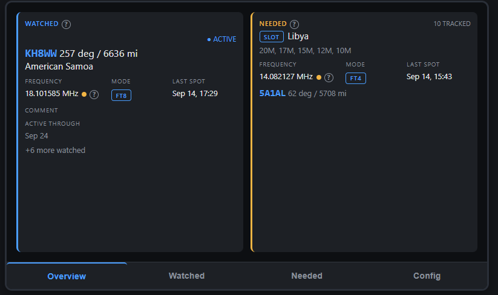

Two panels side by side. The left panel shows your Watched list; the right
shows your Needed list. Each panel shows:

- The featured entry -- whichever one has the most recent real activity.
- Frequency, mode, and when it was last spotted.
- A small colored dot next to the frequency showing the **current band
  condition** for that spot (green/amber/red for good/fair/poor), sourced
  from PropMon. No dot at all means the condition isn't available right
  now -- not a fourth "unknown" state, just no data.
- Which **HamAlert source** actually produced the spot (Cluster, RBN, PSK
  Reporter, and others), shown as a short abbreviation.
- The spotted callsign and a beam heading + distance to it (e.g. "5A1AL --
  62 deg / 5708 mi"), so you know which direction to point your antenna.
  Treat the heading and distance as practical antenna-pointing estimates,
  not precise station coordinates -- they're computed from callsign/prefix
  reference data, not your correspondent's exact location.
- A count of how many other entries you're tracking.

If nothing's currently active, the panel falls back to showing the last real
hit you had, or -- if nothing's ever hit yet -- a simple tracked-count line.

**A genuinely new spot briefly blinks** -- the callsign text and the whole
panel's border flash for a few seconds -- so a real hit catches your
attention even from a glance across the room. The same spot showing up
again on the next routine update doesn't re-trigger it; only an actual new
hit does.

**Tap either panel** to open a full-screen **Recent Activity** feed for that
category -- a scrolling list of every real spot across everything in that
category, most recent first. **Tap any individual spot within that feed**
to drill in further to that callsign's own recent spot history (see
"Drilling into detail" below).

### Watched (tab)

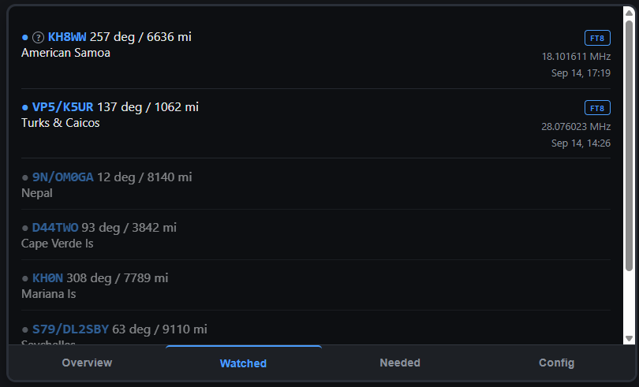

The full list of everything you're watching, each showing its own status
(active/upcoming/waiting for a spot), last spot detail, and beam heading.
Scroll to see everything. **Tap any entry** to see that callsign's own
recent spot history.

### Needed (tab)

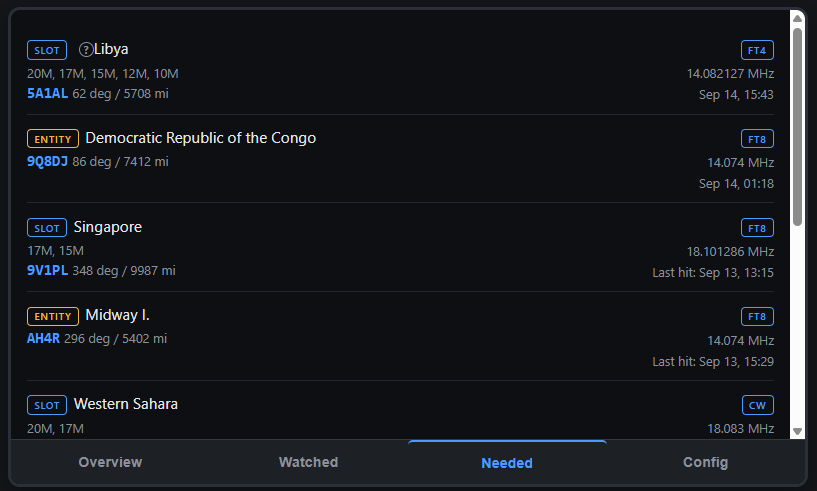

The full list of everything in your curated Needed list. Each entry shows an
**ENTITY** or **SLOT** badge:

- **ENTITY** -- a whole never-confirmed DXCC entity, any band or mode.
- **SLOT** -- a specific band/mode gap on an entity you've already confirmed.

A small **PINNED** badge appears on any entry you've pinned from the web
curation page -- see "Pinning priority entries" below.

Since a single Needed entry can be worked by different callsigns over time
(e.g. different DXpeditions activating the same rare entity), the roster
shows whichever callsign was actually heard for each real hit. **Tap any
entry** to see that entity's own recent spot history across every callsign
that's worked it.

### Drilling into detail

Two related but distinct drill-down screens, reached a few different ways:

- **Recent Activity** (from tapping an Overview panel) -- a chronological
  feed of every real spot across a whole category (everything Watched, or
  everything Needed), newest first.
- **Spot History** (from tapping an individual spot within Recent Activity,
  or tapping a roster row on the Watched or Needed tab) -- the last 10 real
  spots for one specific target. For a Watched entry or an individual
  callsign, this is straightforward -- one callsign's own history. For a
  Needed entity, it's the entity's whole history, potentially spanning
  several different callsigns over time, each shown with its own beam
  heading since they can be worked from different locations.

Both are full-screen views with a back arrow in the top-left corner to
return to wherever you came from.

| Recent Activity (Watched) | Spot History (from a tapped spot) |
|---|---|
| [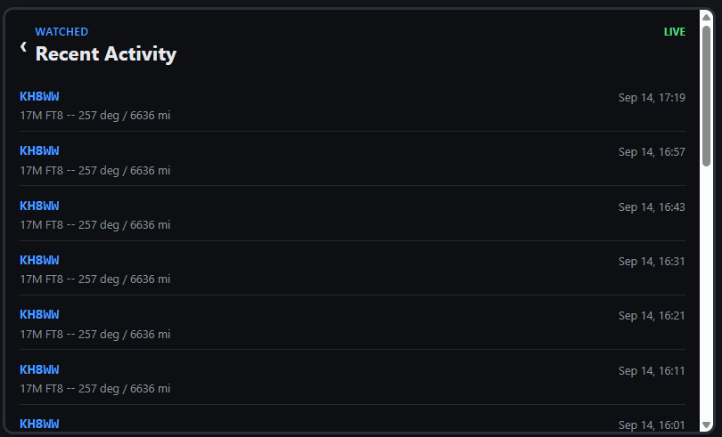](images/dxmon_overview_watched_drill1.png) | [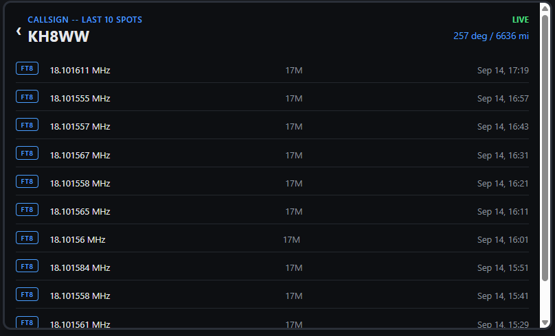](images/dxmon_overview_watched_drill2.png) |

| Recent Activity (Needed) | Spot History (from the Needed tab) |
|---|---|
| [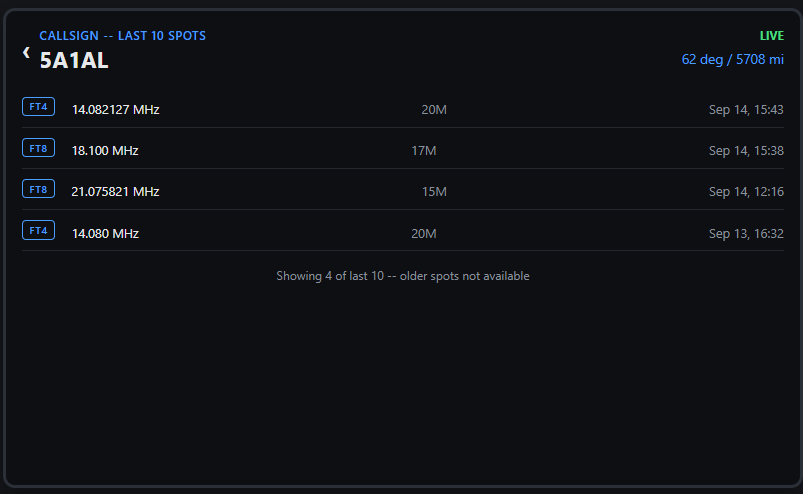](images/dxmon_overview_needed_drill1.png) | [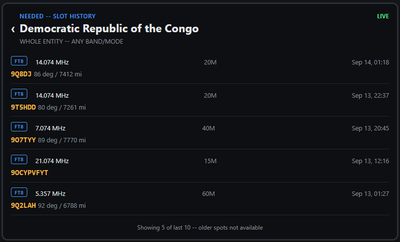](images/dxmon_needed_tab_drill1.png) |

### Config

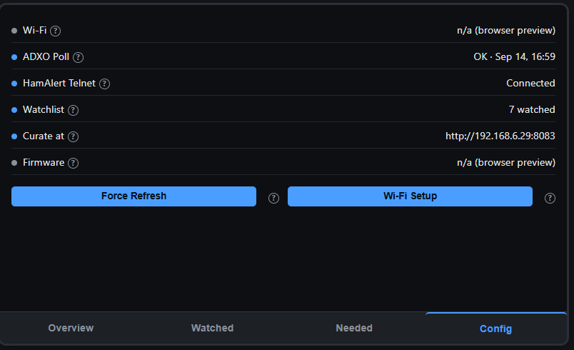

Shows Wi-Fi connection status and IP address, whether the ADXO and HamAlert
backend connections are healthy, how many entries you're watching, the URL
for the web curation pages, and the firmware version. Includes a **Force
Refresh** button if you want to pull fresh data immediately rather than
waiting for the next automatic update.

**Wi-Fi Setup** lets you connect DXMon to a different network without
reflashing the firmware:

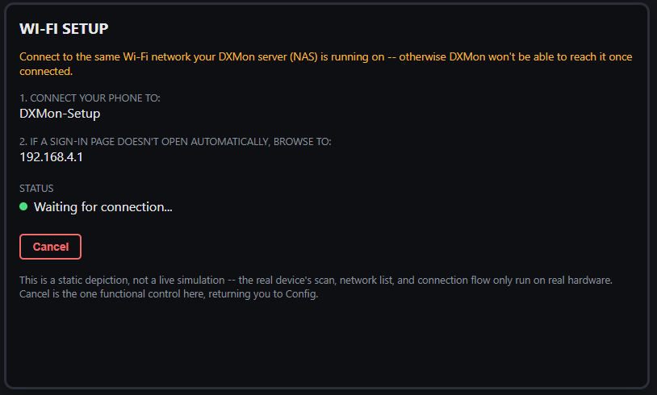

1. Tap **Wi-Fi Setup**. The device scans nearby networks, then opens its own
   temporary network (`DXMon-Setup` by default).
2. Connect your phone to that network. Most phones pop open a sign-in page
   automatically; if not, browse to `192.168.4.1`.
3. Pick your real network and enter its password. **Connect to the same
   network your DXMon server is running on** -- otherwise the device won't
   be able to reach it once connected.
4. On success, the device saves the new credentials and restarts on the new
   network. Tapping **Cancel** at any point also restarts the device, back
   on whichever network it was using before.

The device's touchscreen is unresponsive for a few seconds while it actually
tries connecting with what you entered -- that's expected, since your
attention is on the phone at that moment anyway.

## Curating your lists (web pages)

All curation happens on the web pages served by the backend --
`http://<your-server-ip>:8083/`. The device itself never edits your lists;
it only displays what you've curated here.

### Browse ADXO (`/`)

> ⚠️ **If you're running your own DXMon instance** (not N4MI's), make sure
> you've secured your own permission from NG3K before this page shows you
> anything -- see `README.md`'s own "Data sources" section for the full
> notice. Permission is per-installation, not automatically inherited from
> this codebase's own history of use.

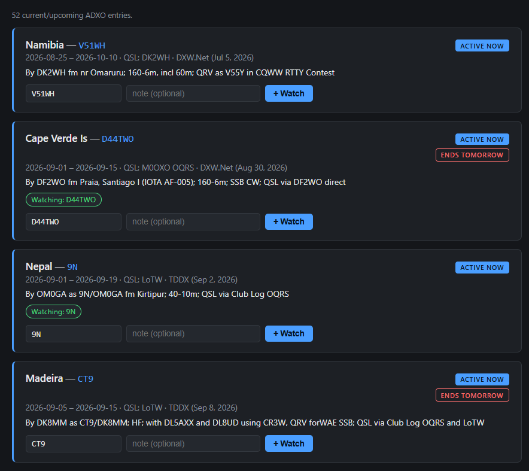

Browse currently-announced DXpeditions and add any you want to follow to
your Watched list with one click. Anything you've already added floats to
the top of the list, soonest-ending first, so your own watchlist doesn't
get buried under entries you haven't looked at yet. A DXpedition ending
within the next 3 days shows a small countdown flag ("Ends in 3 days,"
"Ends tomorrow," "Ends today") next to the Active Now badge.

### Watched (`/watched`)

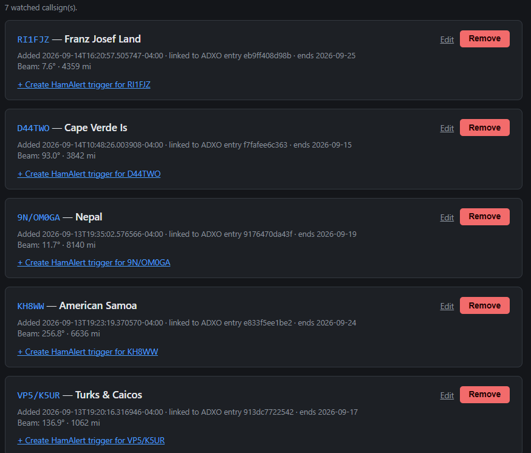

Your curated Watched list. **Edit** an entry to correct its callsign,
DXCC entity, or note -- useful when ADXO only gives a DXpedition's base
prefix (e.g. "9N" for Nepal) but the real on-air callsign is a compound
form (e.g. "9N/OM0GA"). Enter the full compound form here to match
HamAlert's own "Full Callsign" condition -- see Best Practices below.
Remove an entry, or use the **Create HamAlert trigger** link next to it
to get a ready-to-paste trigger recipe for that callsign. Any entry whose
DXpedition end date has passed gets a small amber "Ended" flag, which
stays until you remove the entry yourself -- a deliberate reminder to
also remove the matching HamAlert trigger.

### Needed (`/needed`)

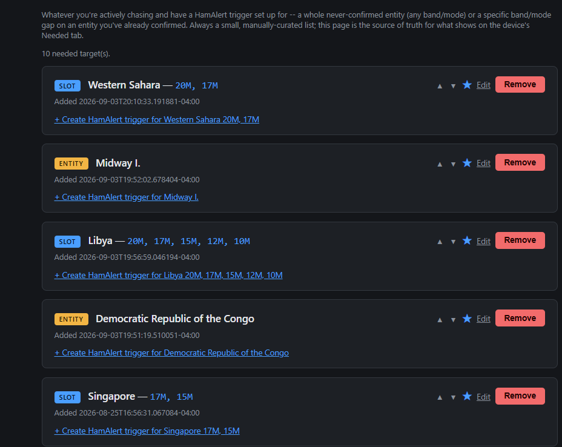

Your curated Needed list. To add an entry:

1. Type the entity name -- **copy it exactly from HamAlert's own DXCC
   condition picker** when you build the matching trigger. Matching only
   handles case and spacing differences, not spelling differences, so this
   is the one step worth getting right.
2. Check any bands and/or modes for a specific slot, or leave everything
   unchecked for a whole-entity target.
3. Optionally add a note, then submit.

Existing entries can be **edited in place** (no need to delete and re-add),
and any entry sitting in the list 30+ days gets a small flag as a reminder to
review whether it's still worth tracking.

**Pinning priority entries:** click the star (☆) next to any entry to pin
it. A pinned entry with nothing currently live floats above the rest of the
alphabetical list -- but a pin never outranks an actual live hit elsewhere,
so the entry with real activity right now always wins regardless of pin
status. Once pinned, use the up/down arrows next to it to reorder it within
your pinned entries. Unpin with the filled star (★).

### Trigger Builder (`/triggers`)

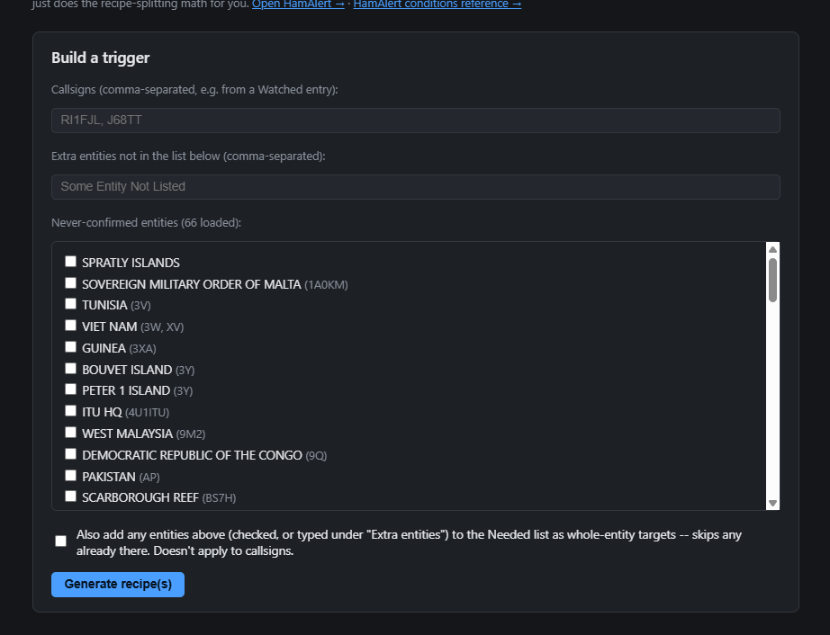

Generates a ready-to-paste HamAlert trigger recipe for any callsign or DXCC
entity. HamAlert has no API for creating triggers automatically -- you still
paste the result into hamalert.org yourself -- but this tool does the
recipe-splitting math for you (avoiding HamAlert's own spot-volume limits on
large multi-entity triggers).

If you're building a trigger for an entity, check **"also add to Needed"**
to curate it as a whole-entity target at the same time, without a separate
trip to the Needed page.

### HamAlert (`/hamalert`)

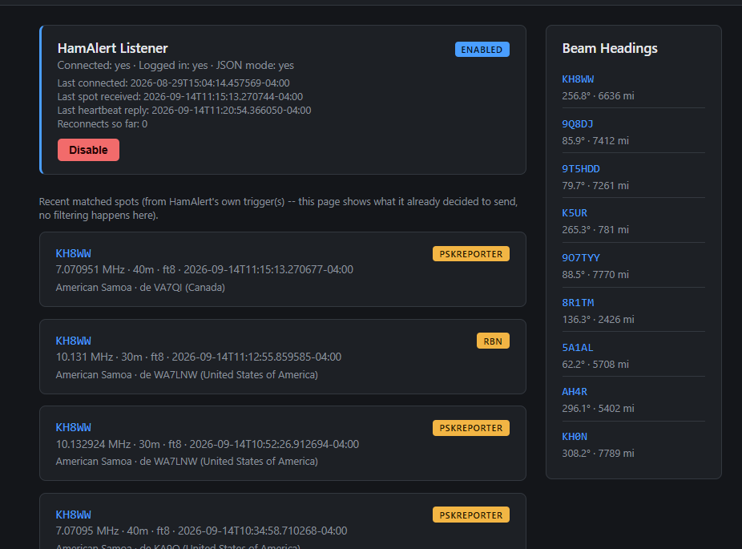

Shows recent real spots HamAlert's own triggers have matched, plus a beam
headings side panel for every distinct callsign currently in that list.
Useful for eyeballing what's actually coming through before it shows up on
the device.

**Pausing HamAlert** (e.g. before a trip) is currently a command-line
action, not a button on this page -- see `server/README.md`'s own
"Pausing HamAlert" section for the exact commands. It's a real, persisted
pause: once disabled, it stays disabled even through a container or NAS
restart, rather than silently reconnecting while you're away.

### Preview (`/preview`)

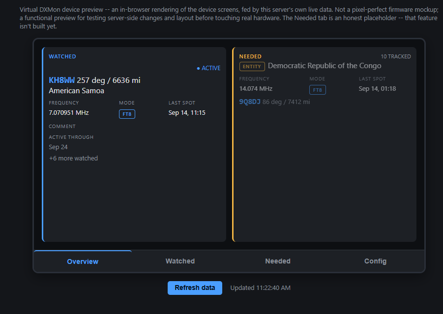

An in-browser rendering of the device's own screens, useful as a quick
remote check when the physical device isn't nearby. It's meant as a
good-enough glance, not an exact mirror of every device screen -- the
band-condition dot, HamAlert source, and drill-down screens are included;
pin/favorite badges and the new-spot flash currently are not. Small **?**
icons around the screens give short explanations on hover (or tap, on a
phone/tablet).

## Beam heading

Wherever you see a callsign next to a heading and distance (device screens,
the HamAlert page, the Watched/Needed web pages), that's a great-circle
bearing and distance from your own station to that callsign, computed
automatically. If a heading is ever missing, the underlying lookup couldn't
resolve that particular callsign -- nothing to configure, it just means that
one entry didn't have a usable heading calculated for it.

## Best Practices

### How DXMon and HamAlert work together

DXMon uses HamAlert to receive spots, but HamAlert triggers and DXMon's
curated lists (`/watched`, `/needed`) are maintained completely separately.
Creating or changing one does not automatically update the other. For a
spot to actually appear as activity on the device, **two matching things
have to exist at once**:

1. A working HamAlert trigger that delivers the spot via the Telnet
   destination.
2. A corresponding entry in DXMon's own `/watched` or `/needed`.

Two real failure modes follow directly from this:

- **A curated DXMon entry with no matching HamAlert trigger** will sit in
  the roster forever, never showing activity, even if real spots for it
  exist elsewhere.
- **A HamAlert trigger with no matching DXMon entry** may still deliver
  spots to the backend, but they won't appear as Watched or Needed activity
  on the device -- just unnecessary spot traffic, potentially contributing
  toward HamAlert's own daily trigger limit for nothing.

The goal is a one-to-one relationship: every useful HamAlert trigger has a
real purpose in DXMon, and every curated DXMon target has a HamAlert
trigger actually behind it.

### Building good HamAlert triggers

- **Use the Trigger Builder (`/triggers`)** rather than hand-building
  conditions directly in HamAlert. It handles the math for splitting a
  large multi-entity trigger into smaller ones for you, which matters
  because HamAlert itself caps how many spots a single trigger can generate
  per day -- a trigger covering too many entities at once can silently hit
  that ceiling.
- **Copy the entity name directly from HamAlert's own DXCC condition
  picker**, and paste that exact string into DXMon's Needed curation page.
  Matching between the two only tolerates case and spacing differences, not
  spelling differences -- this is the single most common reason a real,
  correctly-firing HamAlert trigger never shows up as a hit on DXMon.
- **When curating a SLOT** (a specific band/mode gap), check the same
  bands and modes in DXMon that you set as conditions in the real HamAlert
  trigger. DXMon offers the four modes supported by its current Needed/SLOT
  workflow (CW, SSB, FT4, FT8) -- select the same modes on both sides, or a
  real spot in a mode DXMon doesn't offer a checkbox for will never be
  classified as a match here, even if HamAlert itself matched it.
- **Use "also add to Needed"** on the Trigger Builder page when building an
  entity-level trigger, to curate and set up the alert in one pass instead
  of two separate trips.
- **For compound-callsign DXpeditions** (e.g. ADXO shows "9N" for Nepal,
  but the real on-air callsign is "9N/OM0GA"), use HamAlert's own "Full
  Callsign" condition when building the trigger, and edit the matching
  Watched entry to the same full compound form (see the Watched curation
  page above). DXMon checks a spot's full callsign as well as its plain
  one, so this is the entire fix -- no other setup needed.
- **Manual trigger entry is a real, deliberate checkpoint, not a
  limitation.** DXMon has no API to create HamAlert triggers automatically
  -- you always paste the generated recipe into hamalert.org yourself.
  That manual step is a genuine chance to double-check the callsign or
  entity, full-vs-base callsign form, bands, modes, spot source, Spotter
  Continent, the Telnet destination, and your own comment, before a
  trigger starts consuming spot volume.

#### Spotter Continent

A Spotter Continent condition can substantially cut duplicate or
irrelevant spot volume, and helps keep a busy trigger under HamAlert's own
daily limit. N4MI's own real examples below use `North America` -- that's
this station's own choice, not a required value. Pick whatever continent
or region actually matches your own location and goals. The real tradeoff:
this filter excludes reports from outside the continent you pick, so
you're trading away some early/distant reports for less noise -- worth
understanding before you set it, not just copying N4MI's own choice.

#### Examples from a real setup

The three trigger shapes in practice, all with N4MI's own Spotter
Continent choice (`North America`) added:

**Watched callsign trigger** -- callsign, band, and mode conditions, one
per DXpedition you're following:

[](images/hamalert_watched_trigger.png)

**Needed whole-entity trigger** -- DXCC condition only, no band/mode
restriction, since these are ENTITY-kind Needed targets (any band, any
mode counts):

[](images/hamalert_needed_entity_trigger.png)

**Needed band-slot trigger** -- DXCC, band, and mode conditions together,
matching exactly the bands/modes checked on DXMon's own Needed curation
page for that SLOT-kind entry:

[](images/hamalert_needed_bands_trigger.png)

### Organizing your HamAlert triggers with comments

HamAlert comments are optional, and **DXMon never parses them** -- they're
a purely human-facing organizational aid, not a source of truth for
anything DXMon does. Still, a consistent comment makes it much easier to
compare your HamAlert trigger list against DXMon's own curated lists and
spot anything missing, obsolete, or mismatched.

N4MI's own convention uses three prefixes:

| Prefix | Purpose | Matching DXMon list |
|---|---|---|
| `WATCHED` | A specific DXpedition callsign | `/watched` |
| `NEEDED` | A whole needed DXCC entity | `/needed` as an **ENTITY** |
| `BAND` | Specific needed bands/modes on an already-confirmed entity | `/needed` as a **SLOT** |

```text
WATCHED: Guyana 40m, 20m, 15m, 12m, 10m (ends 2026-09-11)
WATCHED: Nepal (ends 2026-09-19)
NEEDED: Glorioso Is.
BAND: Singapore 17m, 15m FT8
```

A `NEEDED` comment with just the entity name means the whole entity
counts, any band or mode. For a `BAND` trigger, spelling out the bands and
modes in the comment makes the trigger's purpose obvious at a glance, even
though the same information is already visible in HamAlert's own
conditions. For a temporary Watched DXpedition, an end date in
unambiguous `YYYY-MM-DD` form is a useful cleanup reminder -- HamAlert
itself doesn't expire a trigger automatically, but this can be compared
directly against DXMon's own Ended flag when it appears.

**Note the distinction:** `BAND` here is N4MI's own comment label, a
convention for organizing the HamAlert trigger list -- it isn't the same
thing as DXMon's own **SLOT** badge, which is what the device and curation
pages actually call this same kind of entry. This naming convention is a
recommended practice, not a DXMon requirement -- use whatever labels
reliably keep your own triggers and curated entries aligned in your head.

### Watched, Needed, and Needed-slot workflows

The same real steps, once per target, rather than improvising each time:

**Watched** (a specific DXpedition callsign):
1. Select it from Browse ADXO, or add it directly on `/watched`.
2. Confirm the real on-air callsign -- edit it if ADXO only gave a base
   prefix (see "Building good HamAlert triggers" above).
3. Generate the trigger recipe from the Trigger Builder, then enter and
   review it manually in HamAlert, with your own Spotter Continent choice.
4. Add an organizational comment and the operation's end date, if known.
5. Confirm real spots reach `/hamalert` and then the device.
6. When the operation ends: check the Ended reminder on `/watched`, then
   remove or disable the HamAlert trigger *and* remove the Watched entry.

**Needed, whole entity:**
1. Copy the entity name exactly from HamAlert's own DXCC condition picker.
2. Add it to `/needed` with no band/mode restriction.
3. Generate and enter the trigger, optionally checking "also add to
   Needed" to do steps 1-2 and this step together.
4. Confirm the trigger and the DXMon entry use the identical entity name.
5. Remove both once the entity is confirmed and no longer needed.

**Needed, specific band/mode SLOT:**
1. Copy the entity name exactly from HamAlert's own DXCC condition picker.
2. Add the entity to `/needed`, checking only the bands/modes you still
   need.
3. Build the HamAlert trigger with the identical DXCC, band, and mode
   conditions -- a mismatch here means a real spot HamAlert catches can
   still be silently ignored by DXMon.
4. Revise or remove both sides as individual bands/modes get satisfied.

### Keeping your Needed list useful

- **Pin sparingly.** Pinning is for entities you genuinely want to see
  ahead of the pack even when nothing's active -- if everything ends up
  pinned, it stops meaning anything. The list is meant to stay short by
  design; pins work best on top of that.
- **Review the 30-day-stale flag when it appears.** It's not an error, just
  a nudge to reconsider whether something you curated a while ago is still
  worth tracking.
- **The Watched and Needed roster order reflects real-time status** (a
  live hit, pin priority, then alphabetical), not the order you added
  things -- don't rely on list position to remember what you entered when.

### Periodic alignment check

Worth comparing your HamAlert trigger list against `/watched` and
`/needed` whenever:

- A Watched operation reaches its announced end date, or DXMon shows its
  Ended reminder.
- A Needed entry picks up the 30-day review flag.
- A needed entity or band/mode slot gets confirmed.
- A DXpedition changes its callsign, schedule, bands, or modes.
- HamAlert shows a matching spot that never shows up on the device.
- A curated DXMon entry stays quiet despite known real on-air activity.

### Troubleshooting

| Symptom | First things to check |
|---|---|
| A curated target never shows activity | Confirm a matching HamAlert trigger exists, is enabled, and uses the Telnet destination |
| HamAlert shows a spot but DXMon doesn't classify it | Confirm the matching `/watched` or `/needed` entry exists; check entity spelling, full-callsign form, bands, and modes |
| A compound DXpedition callsign never matches | Use HamAlert's Full Callsign condition, and edit the Watched entry to the same complete form |
| Unexpected or heavy spot traffic | Review obsolete triggers, overly broad conditions, and your Spotter Continent filter |
| Every beam heading is blank at once | Server-side issue, not a per-callsign one -- see `server/README.md`'s own beam-heading note |
| No band-condition dot showing | PropMon unreachable, or no current rating for that band -- not a fourth "unknown" state |
| Brief blank screen roughly every 15 minutes | Expected scheduled-reboot mitigation -- see "A quick heads-up" near the top of this guide |
| Device can't reach the server after Wi-Fi Setup | Confirm the device and server ended up on the same network, and that the server address is correct |
